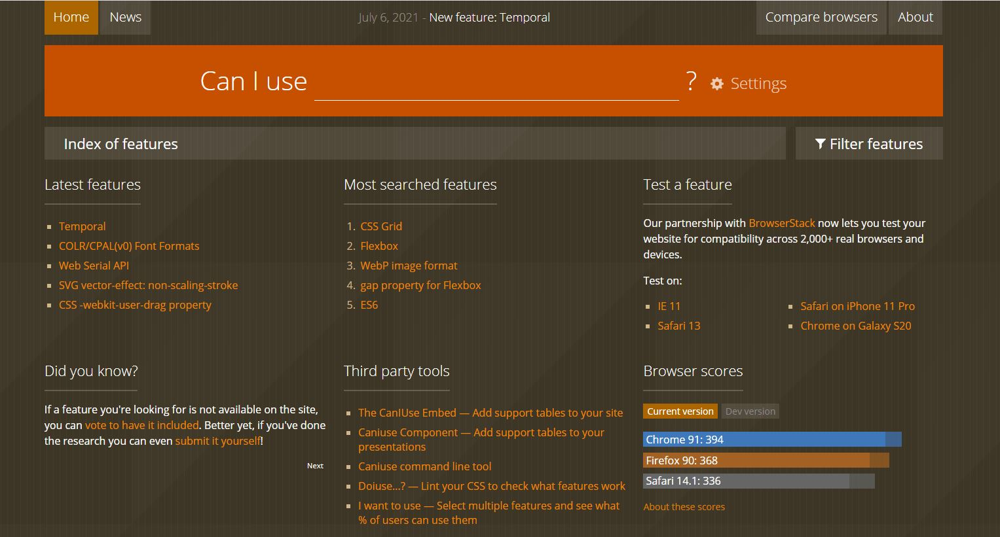

**<브라우저 기술 지원 현황을 확인할 수 있는 사이트>**

- CSS3와 같이 새로 나온 속성들은 브라우저마다 제각기 지원하는 방식이나 지원율이 다를 수 있으므로 반드시 브라우저 지원 현황을 확인하고 사용해야 합니다. 

- 브라우저 기술 지원 현황을 확인할 수 있는 Can I use... 사이트에서 기술명을 검색하여 사용해 보기 바랍니다. 

- 링크 : https://caniuse.com/



- 저는 rem 을 반응형 웹 개발에 사용했는데, 주말에 화면 오류가 접수되어 살펴보니 iOS safari에서 미디어 쿼리와 함께 사용할 수 없다는 오류가 있었습니다. 항상 기술 지원 스택을 확인하고 개발에 사용하는 것이 중요한 것 같습니다. 


- 다시 잘 살펴보니, Iphone XR의 제 safari 브라우저에서는 정상적으로 동작하는 페이지가 Iphone11 의 safari브라우저에서 이미지가 본래 비율을 유지하지 못하고 늘어나는 오류가 있었습니다. px, rem, 가변 그리드를 차례로 줌으로써.. 문제를 해결했지만 원인을 잘 모르겠습니다. 핸드폰에서 사용할 수 있는 개발자 도구가 있을까요?? 

<hr/>

### 가변 폰트

- 기존에 웹사이트를 개발할 때는 고정 단위인 픽셀(px)을 많이 사용했습니다. 하지만 픽셀은 모니터의 해상도를 기준으로 하기 때문에 화면이 확대되거나 축소되는 환경에는 맞지 않습니다. 

- 웹 브라우저에서 정확하게 글자 크기를 나타내려면 상대적인 단위인 em 을 사용하는 것이 좋습니다. 

- 단, 최신 브라우저는 픽셀 px 단위를 사용해도 축소 확대가 가능합니다. 

- 공식 : (가변 폰트를 적용할 글자 크깃 값)/(적용할 요소를 감싸고 있는 요소의 글자 크기값) = 가변 폰트값

- 가변 폰트 크기를 쉽게 계산해주는 사이트  : PXtoEM

http://pxtoem.com/

- 대표적 가변 폰트로는 em, rem이 있습니다. 

- rem은 모바일에서 사용할 때 주의하여야 하는데 미디어 쿼리와 rem 과 함께 사용 시 iOS safari에서는 문제가 될 수 있습니다. (버전 : 5.0-5.1)

<hr />

## 가변 멀티미디어 요소

- 아래 코드는 웹 브라우저에서 화면 크기에 따라 이미지와 비디오가 가변적으로 작동하는 것입니다. 

- 단, 유투브나 비메오 같은 동영상 사이트의 멀티미디어 요소들의 아래의 방법으로 정상적으로 작동하지 않으니 참고하시기 바랍니다. 

```html
<!DOCTYPE HTML>
<html lang="ko">
<head>
<meta charset="UTF-8">
<meta name="viewport" content="width=device-width, initial-scale=1, minimum-scale=1, maximum-scale=1, user-scalable=no">
<title>Document</title>
<style>
*{margin:0; padding:0;}

#wrap{
width:90%;
/* 960px */
margin:0 auto;
border:4px solid #000;
}

#wrap div{
width:50%;
display:inline-block;
}

img, video{
width:100%;
max-width:100%;
}
</style>
</head>
<body>
	<div id="wrap">
		<div>
			<video controls preload="auto">
			    <source src="source/video.mp4" type='video/mp4'></source>
			    <source src="source/video.ogv" type='video/ogg'></source>
			    <source src="source/video.webm" type='video/webm'></source>
		    </video>
		</div><div>
		</div>
	</div>
</body>
</html>
```

- width와 max-width의 차이점 : width 속성은 속성값을 100%로 설정할 경우 요소의 크기를 100%로 유지하지만 max-width 속성은 속성값을 100%로 설정할 경우 요소의 기본 크기 이상으로는 크기가 조절되지 않습니다. 

<hr/>

## 미디어 쿼리

- 미디어 쿼리 이전에 미디어 타입이라는 기술이 있었으나, 미디어의 종류만 감지하기 때문에 기기의 세부적인 사항들은 감지할 수가 없었습니다. 

- 미디어 쿼리는 화면 해상도, 기기 방향 등의 조건으로 HTML에 적용하는 스타일을 전환할 수 있는 CSS3속성 중 하나입니다. 

- 반응형 웹 디자인에서는 미디어 쿼리를 사용해 적용하는 스타일을 기기마다(화면 크기에 따라) 전환할 수 있습니다. 

**<미디어 쿼리의 기본 문법>**

```html
@media [only 또는 not][미디어 유형][and 또는 ,](조건문){실행문}
```

- only : only키원드는 미디어 쿼리를 지원하는 브라우저에서만 미디어 쿼리를 해석하게 해주는 키워드입니다. 

- not : 은 'not tv'일 경우 tv를 제외한 모든 미디어 유형에만 적용합니다. 

- 미디어 유형 : 생략이 가능하며 생략 시에 all 키워드 처럼 작동합니다. 

- and는 앞뒤 조건이 모두 사실일 때 뒤에 따라오는 것을 해석합니다. 

- , 는 앞뒤 조건 중 하나만 사실이더라도 뒤에 따라오는 것을 해석하라는 의미입니다. 

- and와 , 모두 생략 가능합니다. 

- 미디어 쿼리를 적용하기 위해서 아래와 같이 링크 방식으로 넣어줄 수 있습니다. 

```html
<link rel="stylesheet" href="mediaqueries.css">
```

- 문서 내에 작성할 수도 있지만 이 방식은 어쩔 수 없이 사용해야 하는 상황이 아니라면 피하는 게 좋습니다.  

- 그 이유는 CSS코드를 문서 내에 작성하게 될 경우 문서의 용량이 커지고, 이렇게 커진 용량 때문에 속도가 느려져 웹사이트를 방문하는 사용자가 웹사이트를 빨리 볼 수 없기 때문입니다. 

<hr/>

## 화면의 보이는 영역을 다루는 기술, 뷰포트

- 뷰포트는 화면에서 실제 내용이 표시되는 영역입니다. 

- 데스크톱은 사용자가 설정한 해상도가 뷰포트 영역이 되고, 스마트 기기는 기본으로 설정되어 있는 값이 뷰포트 영역이 됩니다. 

- 반응형 웹을 제작할 때 사용하는 뷰포트의 기본 메타 태그는 아래와 같습니다. 

```html
<meta name="viewport" content="width=devide-width, initial-scale=1, minimum-sclae=1, maximum-scale=1, user-scalable=no">
```

- 뷰포트 속성

| 속성명        | 속성값              | 속성설명                                                     |
| ------------- | ------------------- | ------------------------------------------------------------ |
| width         | device-width, 양수  | 뷰포트의 너비를 지정합니다.                                  |
| heith         | divice-height, 양수 | 뷰포트의 높이를 지정합니다.                                  |
| inital-scale  | 양수                | 뷰포트의 초기 배율을 지정합니다.<br />기본값은 1입니다. 1보다 작은 값을 사용하면 축소된 페이지를 표시합니다. |
| user-scalable | yes, no             | 뷰포트의 확대/축소 여부를 지정합니다.<br />no로 설정하면 사용자가 페이지를 확대할 수 없습니다. |
| minimum-scale | 양수                | 뷰포트의 최소 축소 비율을 지정합니다. 기본값은 0.25입니다.   |
| maximum-scale | 양수                | 뷰포트의 최대 확대 비율을 지정합니다. 기본값은 0.5입니다.    |

