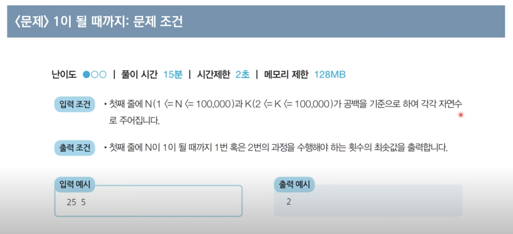

**문제 설명**

    - 어떠한 수 N이 1이 될 때까지 다음의 두 과정 중 하나를 반복적으로 선택하여 수행하려고 합니다. 단, 두번쨰 연산은 N이 K로 나누어 떨어질 떄만 선택할 수 있습니다.
        1. N에서 1을 빼기
        2. N에서 K로 나누기
    - 이때 1번 혹은 2번의 과정을 수행해야 하는 최소 횟수를 구하는 프로그램을 작성하세요.

**내 아이디어**

제 아이디어를 간략히 정리한 것으로 참고만 하시면 좋을 것 같습니다.

    - N과 K의 짝 홀을 나누어 생각합니다
    - 예 : N짝(홀) K짝(홀) -> 나누기(나눠지면 나누기, 아닐 때 뺴기), N홀(짝) K짝(홀) -> 뺴기

**문제조건**

아래 사진을 참고해서 작성해 봅시다.



**파이썬 코드**

`내가 짠 코드`

```python
N, K = map(int, input().split())
print(N, K)

count = 0

while N > 1:
    if N % 2 == 0:
        if K % 2 == 0:
            N /= K
            count += 1
        else:
            N -= 1
            count += 1
    else:
        if K % 2 == 0:
            N -= 1
            count += 1
        else:
            if N % K == 0:
                N /= K
                count += 1
            else:
                N -= 1
                count += 1

print(count)
```

**문제 해결 아이디어**

- 주어진 N에 대하여 최대한 많이 나누기를 수행하면 됩니다.
- N의 값을 줄일 때 2이상의 수로 나누는 작업이 1을 ㅒ는 작업보다 수를 더 많이 줄이게 됩니다.

**아이디어의 정당성 분석**

    - 가능하면 최대한 많이 나누는 작업이 최적의 해를 보장할 수 있을까요?
    - K 가 2 이상이기만 하면, 1을 빼는것보다 K로 나누는 것이 항상 빠르게 N을 줄입니다.

- 최적의 해 성립!

**파이썬 코드**

- 해설 : 10만 이하의 정수라는 조건 없이, 1억 이상의 수가 input 값으로 받아지더라도 시간복잡도를 `log N`으로 가지는 코드를 통해 시간 내 문제를 해결할 수 있다.

`solution.py`

```python
# N, K를 공백 기준으로 구분하여 입력 받기
n, k = map(int, input().split())

result = 0

while True:
    # N이 K로 나누어 떨어지는 수가 될 때까지 뺴기
    target = (n // k) * k  # 소수점 이하 버리는 나눗셈 연산
    result += (n - target)
    n = target
    # N이 K보다 작을 때 (더 이상 나누지 못하면) 반복문 탈출

    if n < k:
        break
    # K로 나누기
    result += 1
    n //= k

# 마지막으로 남은 수에 대하여 1씩 뺴기
result += (n - 1)
print(result)

```

- 이해 못했던 점 :  
  `# N이 K로 나누어 떨어지는 수가 될 때까지 뺴기`
  이 부분이 이해가 안되었는데, 소수점 이하 버리는 나눗셈에 다시 K를 곱하니까 K로 무조껀 나누어지는 수가 되고 target을 n에서 뺴주니 1을 몇번 빼주었는지 확인하여 count를 세는 원리였다.
