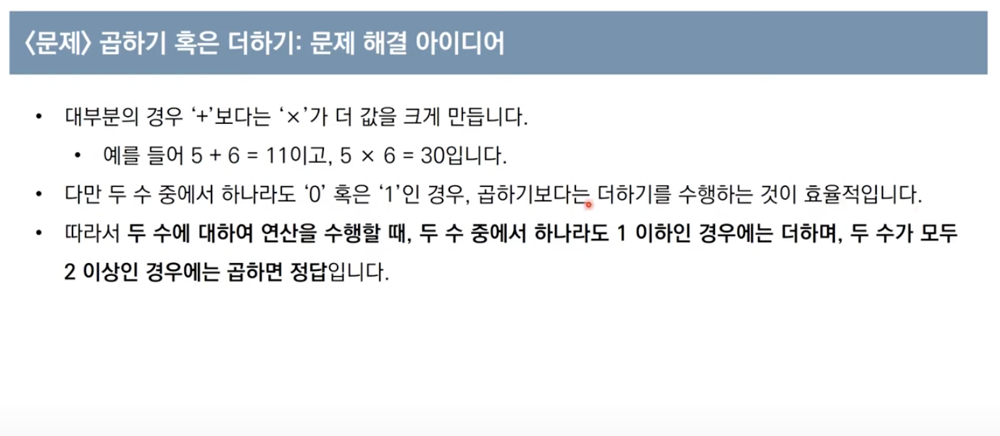

**문제설명**


20억이 최대인 이유: int형 표현에서 21억까지 나타낼 수 있는 언어(예 : C)가 있기 때문입니다. 그러나 파이썬의 경우 그 이상도 표현할 수 있습니다.

**문제조건**


**내 아이디어**

제 아이디어를 간략히 정리한 것으로 참고만 하시면 좋을 것 같습니다.

- 첫번째 숫자가 0일 경우 더하기 진행, 다음 숫자가 0일 경우 더하기 진행
- 나머지는 곱하기로 처리

**파이썬 코드**

`내가 짠 코드`

```python

string_num = input()

list_num = list(string_num)

list_new = []

for i in range(0, len(list_num)):
    list_new.append(int(list_num[i]))


print(list_new)
result = 0

for i in range(0, len(list_new)):
    if list_new[i] == 0 or result == 0:
        result += list_new[i]
    else:
        result *= list_new[i]

print(result)
```

**익숙하지 않은 파이썬 문법 공부**

```python

list()
#문자열을 리스트로 변환(문자하나하나가 리스트 요소가 된다. )

a = []
#빈 리스트를 선언한다.

len(a)
#리스트의 길이를 구한다.

a.append
#리스트에 요소를 축한다.

for i in range(0, 10)
#0부터 9까지 for 문

#if 뒤에 괄호 없다.

```

**문제 해결 아이디어**



\*_내 풀이의 오류_

- 1은 더하는 것이 곱하는 것보다 유리하다!
- Result가 1일 때에도 다음 수를 더하는 것이 유리하다.

`수정 코드`

```python
string_num = input()

list_num = list(string_num)

list_new = []

for i in range(0, len(list_num)):
    list_new.append(int(list_num[i]))


print(list_new)
result = 0

for i in range(0, len(list_new)):
    # if 조건 수정
    if list_new[i] <= 1 or result <= 1:
        result += list_new[i]
    else:
        result *= list_new[i]

print(result)

```

**파이썬 코드**

`solution.py`

```python
data = input()

# 첫 번쨰 문자르 숫자로 변경하여 대입
result = int(data[0])

for i in range(1, len(data)):
    # 두 수 중에서 하나라도 '0'혹은 '1'인 경우, 곱하기보다는 더하기 수행
    num = int(data[i])
    if num <= 1 or result <= 1:
        result += num
    else:
        result *= num

print(result)

```
