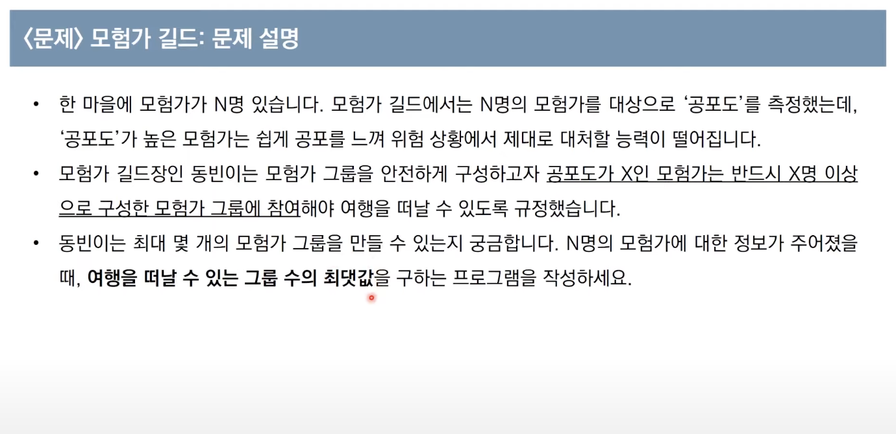
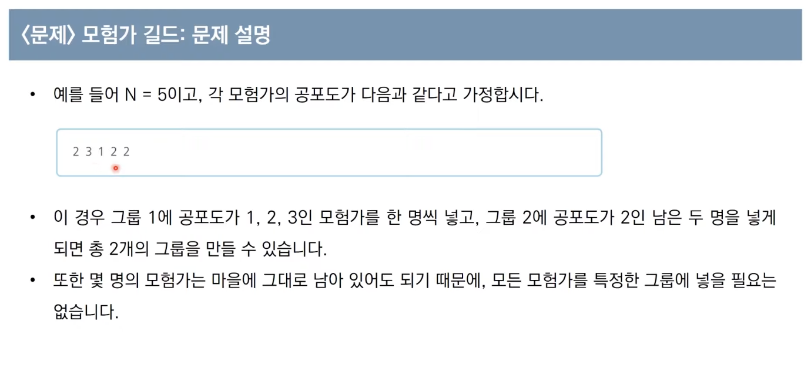

**문제설명**





**문제조건**


**내 아이디어**

제 아이디어를 간략히 정리한 것으로 참고만 하시면 좋을 것 같습니다.

- 공포도가 적은 수의 모험가부터 그룹을 만들어 줍니다,
- 모험가의 공포도보다 남은 인원수가 적으면 그 모험가부터 다음모험가들은 모험에 참여시키지 않습니다. (반복문 탈출)

**파이썬 코드**

`내가 짠 코드`

```python
N = int(input())

arr = list(map(int, input().split()))
arr.sort()
print(arr)

count = 0
for i range(0,len(arr)):
    plus_index = arr[i]-1
    if arr[i+plus_index] > arr[i]:
        plus2_index = arr[i+plus_index]-1

```

다음에 이어서 문제풀이를 진행하겠습니다.
