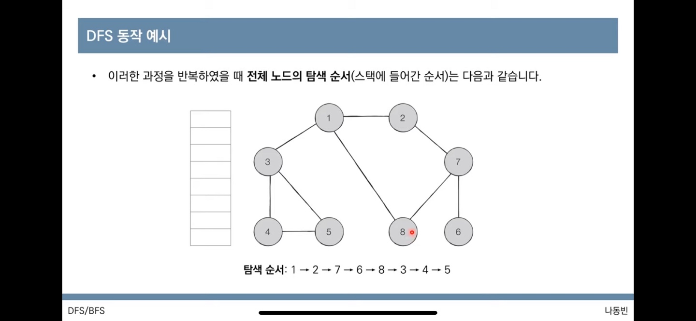

사전에 필요하 지식 : 스택, 큐, 재귀함수

## 그래프 탐색 알고리즘: DFS/BFS

- 탐색이란 많은 양의 데이터 중 원하는 데이터를 찾는 과정을 의미
- 대표적 그래프 탐색 알고리즘 : DFS, BS

### 파이썬에서 스택 사용하기

- 리스트(list)

```python
stack = []
stack.append(1)
stack.append(2)
stack.append(3)
stack.pop()

print(stack[::-1])
#거꾸로 출력해야 스택 자료구조에 맞춘 것
```

### 파이썬에서 큐 사용하기

- 리스트를 사용하는 것보다 deque를 사용하는 것이 시간 복잡도 상으로 유리

```python
queue = deque()

queue.append(1)
queue.append(2)
queue.append(3)
queue.popleft()

print(queue)

queue.reverse()
#역순으로 큐 변경
```

### 재귀함수

- 자기자신을 다시 호출 하는 함수
- 최대 깊이 초과 메세지가 뜰 수 있다.
- 반복문으로 똑같이 구현할 수 있다.

- 대표적인 예제
  - 최대공약수(GCD) 계산(유클리드 호제법) : 두 자연수 A, B에 대해서 (A > B) A를 B로 나눈 나머지가 R 이면 A와 B의 최대공약수는 B와 R의 최대 공약수와 같다.

<hr/>

## DFS(Depth-First Search)

- 깊이 우선 탐색으로 그래프의 깊은 부분을 우선적으로 탐색한다.
- 구현
  - 탐색 시작 노드를 스택에 삽입하고 방문 처리를 한다.
  - 스택의 최상단 노드에 방문하지 않은 인접한 노드가 하나라도 있으면 그 노드를 스택에 넣고 방문 처리한다. 방문하지 않은 인접 노드가 없으면 스택에서 최상단 노드를 꺼낸다.
  - 위의 과정을 반복합니다.

### DFS 동작 예시

- 방문 기준은 문제에 따라 달라질 수 있다.
  예시 : 번호가 낮은 인접 노드
- 아래 그림 참고
  

<hr/>
<hr/>

## 문제풀이

### 음료수 얼려 먹기

`입력예시`

```
4 5
00110
00011
11111
00000
```

`출력예시`

```
3
```

`.py`

```python
#DFS

def dfs(x, y):
    if x <= -1 or x >= n or y <= -1 or y>= m:
        return False
    if gragh[x][y]==0:
        graph[x][y] = 1

        dfs(x-1,y)
        dfs(x+1,y)
        dfs(x,y-1)
        dfs(x,y+1)
        return True
    return False

n,m = map(intminput().split())

graph = []
for i in range(n):
    graph.appned(list(map(int,input())))

result = 0
for i in range(n):
    for j in range(m):
        if dfs(i,j) == Ture:
            result += 1
print(result)
```

<hr/>

### 미로 탈출

`입력예시`

```
5 6
101010
111111
000001
111111
111111
```

`출력예시`

```
10
```

`.py`

```python
#BFS
from collections import deque

def bfs(x, y):
    queue = deque()
    queue.append((x,y))

    while queue:
        s, y = queue.popleft()

        for i in range(4):
            nx = x+dx[i]
            ny = y+dy[i]

            if nx < 0 or nx >= n or ny < 0 or ny>= m:
                continue
            if gragh[nx][ny]==0:
                continue
            if graph[nx][ny] == 1:
                graph[nx][ny] = graph[x][y]+1
                queue.append((nx,ny))

    return graph[n-1][m-1]

n,m = map(intminput().split())

graph = []
for i in range(n):
    graph.appned(list(map(int,input())))

dx = [-1,1,0,0]
dy = [0,0,-1,1]

print(bfs(0,0))
```
