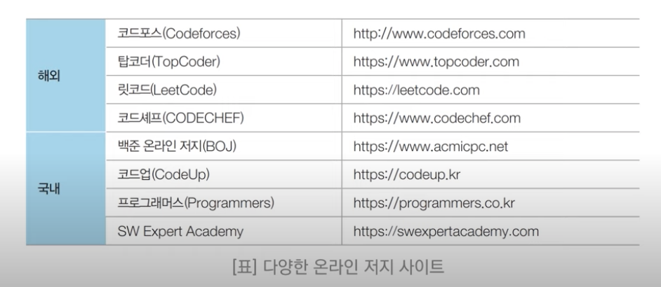
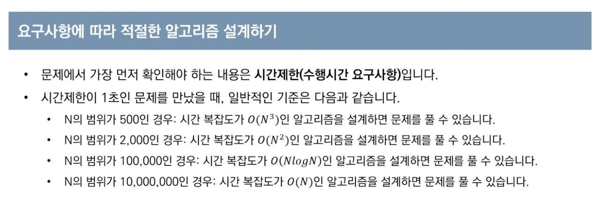
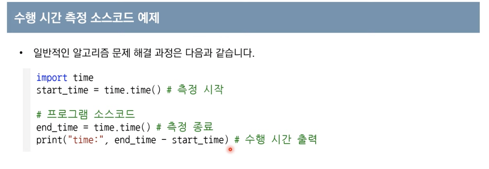

코딩테스트의 정의는 다음과 같습니다.

- 코딩테스트 : 일종의 문제 풀이 시험으로 프로그램 역량 평가를 목적으로 한다.

유형을 살펴보면 온라인과 오프라인이 있는데, 온라인으로 1차 시험을 오프라인으로 2차 시험을 시행하는 경우가 많습니다.

**유형**

- 온라인 : 온라인 검색 허용 [o]
- 오프라인 -> 검색 허용 x

## 코딩테스트 공부하기

코딩테스트 공부를 할 때는 `온라인 저지(online-judge`를 이용하는 것이 좋습니다. 관련 사이트는 아래 그림을 참고해 주세요.

특히 추천할 사이트는 백준, 코드업, 프로그래머스 입니다.

**추천 사이트**

- 백준(유형별 풀이 가능, 대기업 코딩테스트 문제 다수 수록)
- 코드업(단계별 풀이 가능, 초보자 전용)
- 프로그래머스(인기 대회 문제 다수 수록)

**추천 언어**

코딩 테스트를 할 때 유용한 언어에는 `c++(1위)`, `python(2위)` 가 있습니다.

**추천 온라인 개발 환경**

- 리플릿(온라인 개발 환경) : https://repl.it/
- 파이썬 튜터(온라인 개발 환경)
- 파이참(오프라인 개발 환경)
- Dev C++(오프라인 개발 환경)

**자신만의 소스코드 관리하기**

코딩 대회에서 팀 코드를 활용할 수 있는 경우가 있으므로 github를 이용해서 자신의 코드를 관리하는 것이 좋습니다.

카카오 코딩 테스트 ->카카오 기술 블로그에서 시험문제가 잘 정리되어 있다.

## 코딩테스트 필수지식

알고리즘 성능 평가를 하는 방법은 아래왁 같습니다.

**복잡도**

- 시간복잡도
  수행 시간은 데이터의 개수 N에 비례할 것입니다.

- 공간복잡도

여기서 복잡도는 낮을수록 좋은 소스코드 입니다.

- 복잡도 표기 : 빅오 표기법

**알고리즘 설계 TIP**

코딩 테스트 문제에서 시간제한은 통산 1~5초 가량 입니다.
통상 파이썬이 c++보다 많은 시간이 걸릴 수 있으며, py로 제출해서 시간제한에 걸리면 pypy로 제출해보는 것도 좋습니다.

하지만 제일 중요한 것은 사전에 시간을 에측해서 알고리즘을 설계하는 것입니다. 아래의 시간계산 팁을 활용하면 좋을 것 같습니다.

**알고리즘 문제 해결 과정**

알고리즘 문제의 해결과정은 아래와 같습니다. 코드 작성 전 좋은 전략을 세우는 것입니다.

1. 질문 읽기 및 컴퓨터적 사고
2. 요구사항 분석(복잡도)
3. 문제해결을 위한 아이디어 찾기
4. 소스코드 설계 및 코딩

**수행 시간 측정 소스코드 예제**

수행시간 측정 소스코드 예제를 참고하여 문제 제출 시 의도했던 방식대로 코드를 작성해 봅시다.

다음 글에서는 간단히 파이썬 문법을 복습하겠습니다.
