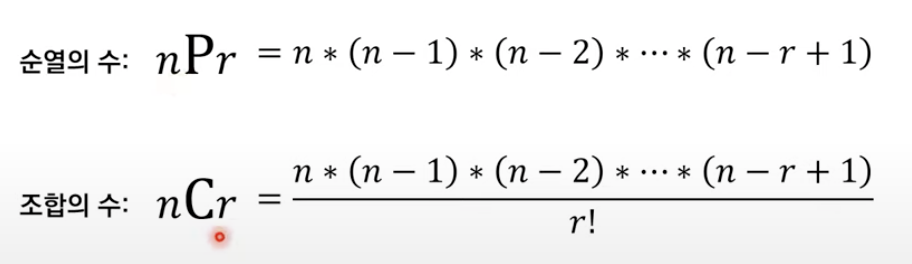

**실전에서 유용한 표준 라이브러리**

1. 내장함수

2. itertools

   - 파이썬에서 반복되는 형태의 데이터를 처리하는 데 사용합니다.
   - 순열과 조합 라이브러리는 특히 코딩 테스트에서 많이 사용합니다.

3. heapq

   - 힙 자료구조를 제공합니다.
   - 일반적으로 우선순위 큐 기능 구현에 사용합니다. (최단 거리 알고리즘)

4. bisect

   - 이진 탐색 기능을 제공합니다.

5. collections

   - `deaue`, `Counter`등의 자료구조를 포함합니다.

6. math
   - 팩토리얼, 제고근, 최대공약수, 삼각함수부터 파이 상수를 포함합니다.

**내장함수**

```python
#sum
result = sum([1, 2, 3, 4, 5])
print(result)

#min(), max()
min_result = min(7, 5, 3, 2)
max_result = max(7, 5, 3, 2)
print(min_result, max_result)

#eval()
result = ecla("(3+5)*7")
print(result)

#sorted()
result = sorted([9, 1, 8, 5, 4])
reverse_result = sorted([9, 1, 8, 5, 4], reverse = True)

#sorted() with Key
array[('이순신', 32), ('홍길동', 50)]
result = sorted(array, key = lambda x:x[1], reverse=True)
```

**순열과 조합**

1. 순열 : 서로 다른 n 개에서 서로 다른 r 개를 선택하여 일렬로 나열하는 것입니다.

2. 조합 : 서로 다른 n 개에서 순서에 상관없이 서로 다른 r 개를 선택하는 것입니다.



`순열`

```python
from itertools import permutations

data = ['A', 'B', 'C']

result= list(permutations(data, 3))
print(result)
#[('A', 'B', 'C'), ('A', 'C', 'B'), ('B', 'A', 'C'), ('B', 'C', 'A'), ('C', 'A', 'B'), ('C', 'B', 'A')]
```

`조합`

```python
from itertools import combinations

data = ['A', 'B', 'C']

result= list(combinations(data, 3))
print(result)
#[[('A', 'B'), ('A', 'C'), ('B', 'C')]
```

`중복 순열과 중복조합`

```python
from itertools import product

data = ['A', 'B', 'C']

result= list(product(data, repeat = 2))
print(result)
#2개를 뽑는 모든 순열 구하기  (중복 허용)

from itertools import combinations_with_replacement

data = ['A', 'B', 'C']

result= list(combinations_with_replacement(data, 2))
print(result)
#2개를 뽑는 모든 조합 구하기  (중복 허용)
```

**Counter**

- 등장 횟수를 세는 기능을 제공하는 함수로 리스트와 같은 반복 가능한 객체가 주어지면 내부의 원소가 몇 번씩 등장했는지 등장했는지 알려줍니다.

**최대 공약수와 최소 공배수**
