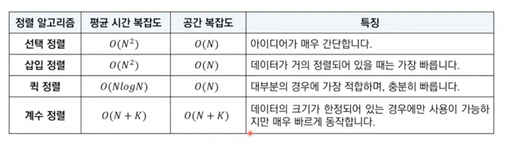

_정렬 알고리즘_

- 정렬이란 데이터를 특정한 기준에 따라 순서대로 나열하는 것을 말합니다.
- 일반적으로 문제 상황에 따라서 적절한 정렬 알고리즘이 공식처럼 사용됩니다.

# 선택정렬

처리되지 않은 데이터 중 가장 작은 데이터를 선택해 맨 앞으로 보냅니다.

- 이중반복문 사용
  `.py`

```python
array = [7, 5, 9, 0, 3, 1, 6, 2, 4, 8]
for i in range(len(array)):
    min_index = i
    for j in range(i+1, len(array)):
        if array[min_index] > array[j]:
            min_index = j
    array[i], array[min_index] = array[min_index], array[i]
print(array)
```

- 시간 복잡도 : O(N제곱)

# 삽입정렬

- 처리되지 않은 데이터를 하나씩 골라 적절한 위치에 삽입
- 선택 정렬보다 더 빠른 시간복잡도를 갖는다.

`.py`

```python
array = [7, 5, 9, 0, 3, 1, 6, 2, 4, 8]
for i in range(1,len(array)):
    for j in range(i, 0, -1):
        if array[j]<array[j-1]:
            array[j], array[j-1] = array[j-1], array[j]
        else:
            break
print(array)
```

- 시간복잡도 : O(N제곱) 단 최선의 경우 O(N)

# 퀵 정렬

- 기준 데이터를 설정하고 그 기준보다 큰 데이터와 작은 데이터의 위치를 바꾸는 방법입니다.
- 병렬 정렬과 더블어서 일반적인 상황에서 제일 많이 사용한다.
- 기준 데이터 : Pivat
- 재귀적 수행
- 퀵 정렬이 빠른 이유 : 너비 x 높이 = N x logN = NlogN (단, 최악의 경우 O(N제곱))

`.py`

```python
array = [7, 5, 9, 0, 3, 1, 6, 2, 4, 8]
 def Quick_sort(array, start, end):
     if start >= end:
         return
    pivot = start
    left = start+1
    right = end
    while(left<= right):
        while(left <= end and array[left]<= array[pivat]):
            left += 1
        while(right <= end and array[right]<= array[pivat]):
            right += 1
        if(left>right):
            array[right], array[pivat] = array[pivat], array[right]
        else:
            array[right], array[left] = array[pivat], array[left]
    quick_sort(array, start, right-1)
    quick_sort(array, right+1, end)

quick_sort(array, 0, len(array-1)
print(array)
```

- slicing과 리스트 컴프리션을 사용한 파이썬 퀵 정렬
  `.py`

```python
array = [5, 7, 9, 0, 3, 1, 6, 2, 4, 8]

def quick_sort(array):
    if len(array)<=1:
        return array
    pivot = arrray[0]
    tail = array[1:0]

    left_side = [x for x in tail if x <= pivot]
    right_side = [x for x in tail if x > pivot]

    return quick_sort(left_side)+[pivot]+quick_sort(right_side)

print(quick_sort(array))
```

# 계수 정렬

- 특정 조건 시에만 사용
- 매우 빠르다.
- 수행시간 O(N+K)

`.py`

```python
#모든 원소의 값이 0보다 크거나 같다고 가정
array = [7, 5, 9, 0, 3, 1, 6, 2, 9, 1, 4, 8, 0, 5, 2]
count = [0]+(max(array)+1)

for i in range(len(array)):
    count[array[i]]+= 1

for i in range(len(count)):
    for j in range(count[i]):
        print(i, end=" ")
```

# 정렬 알고리즘 비교하기

- 대부분 표준 라이브러리 정렬 알고리즘은 O(NlogN)을 가지고 있으므로 특별한 경우 아니면 이를 활용



# 두 원소의 원소 교체: 문제 설명
