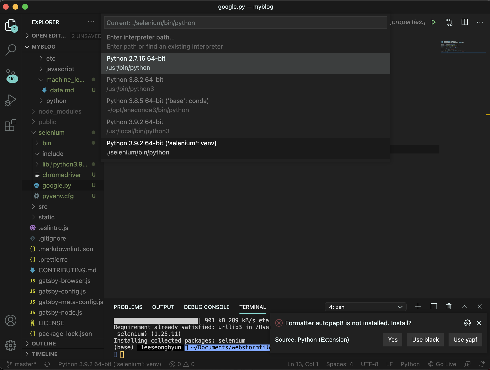

- 파이썬 셀레니움 이미지 크롤링을 이용한 포스팅입니다.

1. 파이썬 가상환경 만들기

   - 터미널에 아래 명령어를 입력합니다.
   - venv를 사용하여 현재 열려있는 폴더에 selenium폴더를 만든다는 뜻입니다.
     `python3 -m venv selenium`

   `cd seledium\bin`
   `activate`
   `pip install selenium`

2. 크롬 드라이버 다운받기
   - https://chromedriver.chromium.org/downloads 로 이동합니다,
   - 자신의 크롬 버전 확인 후 버전과 운영체제에 맞는 것을 다운합니다.
     (버전확인은 오른쪽 위 점 세개 -> 도움말 -> chrome정보에서 확인 가능합니다. )
   - 압축을 풀고 selenimum 폴더로 크롬 드라이버를 이동시킵니다.
   - 셀레니움 폴더에 `google.py` 파일을 만들어 줍니다.
   - python selenium example 코드를 복사합니다 . ( 아래 코드는 공식 문서 예제 )

`google.py`

```python
from selenium import webdriver
from selenium.webdriver.common.keys import Keys

driver = webdriver.Firefox()
driver.get("http://www.python.org")
assert "Python" in driver.title
elem = driver.find_element_by_name("q")
elem.clear()
elem.send_keys("pycon")
elem.send_keys(Keys.RETURN)
assert "No results found." not in driver.page_source
driver.close()
```

    - 파이썬의 버전을 셀레니움으로 바꾸어 줍니다. (아래 사진 참고) 하단에 버전이 써져 있는 곳을 누르면 창이 나타나고 셀레니움이라고 적혀있는 것을 누르면 됩니다.



- 현재 개발 오류가 발생하여 다음에 이어서 포스팅하도록 하겠습니다.
